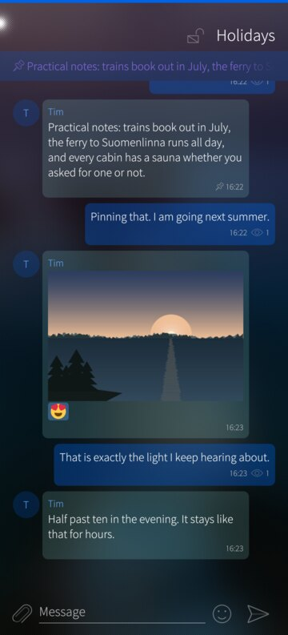
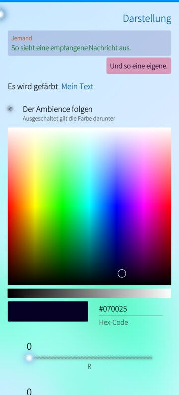
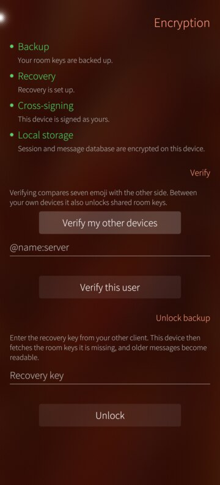
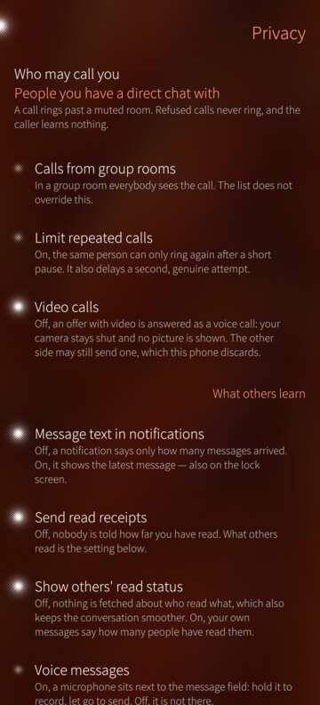

# xmatic

A native [Matrix](https://matrix.org) client for **Sailfish OS**, with a Silica
interface and a protocol core built on
[matrix-rust-sdk](https://github.com/matrix-org/matrix-rust-sdk).

Sailfish OS 5 still ships Qt 5.6, which rules out the existing Qt Matrix
libraries. xmatic links the same Rust core that modern clients use and keeps Qt
as the view layer, so sliding sync, end-to-end encryption, cross-signing,
device verification and key backup come from upstream rather than from this
repository.

## What works

* Sign-in through the homeserver's own page (OAuth 2.0 / MAS), by device code
  on another machine, or by password where the server offers no OAuth; the
  session survives restarts
* Session and local stores encrypted with a key from Sailfish Secrets. A
  device whose system does not provide that key service creates no store at
  all: it says what is missing, how to install it and how to check the result,
  and running without encryption is an explicit choice rather than a silent
  fallback
* Four coloured lines say how safe the device is — backup, recovery,
  cross-signing, local storage. Green is in order, orange is a fault you can
  clear, red is missing. Where something is not green they come up once after
  starting, with the action that fits and "later" always available
* Room list over Simplified Sliding Sync: search, unread counts, favourites,
  low priority, mute
* Timeline in encrypted rooms: send, reply, edit, delete, paginate. A message
  that could not be sent can be sent again or discarded
* Reactions, sent and shown, grouped by character with a count; the picker's
  first tab is yours to fill - press and hold any emoji to keep it there - and
  the keyboard covers what the set does not
* Formatted messages rendered as formatting — bold, italic, code, quotes,
  lists, headings, links. The HTML a message carries is rewritten inside the
  app instead of being handed to a markup parser
* Attachments: pictures with full-screen zoom, video, files; save, share,
  forward. Voice messages recorded and played in place
* Device verification in both directions, cross-signing, key backup and
  recovery, and a warning before sending to devices you never verified
* Notifications for rooms not on screen, with a background wake-up; tapping one
  opens the room it is about. Messages written offline go out when the network
  returns
* Rooms: create (public or invite-only, encrypted or not, both settled at
  creation), invite, join by address, leave, direct chats, and a search across
  public room directories
* A room opens where you stopped reading, counts as read while it is read, and
  can be marked read from the chat list without opening it
* Matrix links lead into the app: a permalink or a plain #room:server opens the
  room, or offers to join it - the tap itself never joins
* Spaces as their own navigation level: nested, unread badges, rooms added and
  moved by long-press, either list as the start page
* Members: list per room, profile with the encryption identity, moderation
  where the power levels allow it, account-wide ignore list
* Threads: answer in one, or start one from any message; replies stay in the
  room's timeline as well
* Pinned messages, own display name and avatar, profile pictures
* Whether a room is encrypted is a padlock in front of its name: closed, or
  open with its body struck through
* Text typed and not sent stays in the room until it is; it is kept in memory
  only and never written to disk
* Who read a message, and who set a reaction — both asked for on demand rather
  than carried by every row
* Deleting a message takes a countdown, the way leaving a room does
* A share target for the system's share dialog, running or not
* Voice and video calls over WebRTC. The media is encrypted between the two
  devices either way; in an encrypted room the signalling is too, which is what
  makes the call end-to-end and not merely encrypted on the wire
* Twenty-nine interface languages, picked in the app rather than only by the
  phone's setting

## What it looks like

| | | |
|---|---|---|
|  |  |  |
| A conversation: replies, reactions, pinned message, pictures | Every bubble, name and text colour is yours to set | What is safe on this device, in four lines |
|  |  |  |
| What others learn, and what stays here | Twenty-nine languages, switchable in the app | Public rooms, from your server or another |

Taken on a phone with a camera cutout, on two different ambiences — the app
takes its colours from the one you use.

## What does not

* **Homeservers that sign in through their own web page (SSO).** OAuth 2.0 /
  MAS, the device code and the password flow work; the SSO redirect does not,
  and the login page says so.
* **Clients that only speak MatrixRTC.** They dropped the classic 1:1 call
  flow (MSC2746); where a client still offers the legacy button, that one
  interoperates.
* Received video is converted frame by frame on the CPU — functional, but not
  as smooth as the outgoing direction. No GStreamer sink on this device draws
  into a QML scene.
* The app has to stay open; its cover on the home screen is the running
  process. There is no background daemon, the same way other messengers on
  this platform work.
* Spoilers are marked rather than hidden: the text renderer available here
  cannot hide a run of text.
* **Most translations are unreviewed.** German is the project language,
  Norwegian came largely from a Norwegian speaker, and Finnish, Swedish and
  Danish had a correction pass. The rest, Chinese and Hindi among them, are a
  single machine pass. An offer to review one is welcome — open an issue and
  you get a numbered sheet.
* Reactions are drawn as the characters they are, which on this Qt means
  monochrome. Pictures of your own can be used instead (Appearance); none are
  shipped and none are downloaded.

## Requirements

* Sailfish OS 5.0 or newer on aarch64, or Sailfish OS 4.6 on armv7hl
  (community ports — see the note below), developer mode enabled
* Sailfish OS Platform SDK with the `SailfishOS-5.0.0.62-aarch64` target, plus
  `gstreamer1.0-devel`, `gstreamer1.0-plugins-base-devel` and
  `gstreamer1.0-plugins-bad-devel` installed into it
* Rust via rustup (version pinned in `rust-toolchain.toml`) and `cbindgen`
* A homeserver supporting Simplified Sliding Sync (MSC4186) — Synapse 1.114 or
  newer

## Building

```sh
cargo install cbindgen                     # once
scripts/build-core.sh                      # cross-build the Rust core
mb2 -t SailfishOS-5.0.0.62-aarch64 build   # build the RPM
```

32-bit, against Sailfish 4.6 with the matching SDK target:

```sh
SFOS_RELEASE=4.6.0.13 SFOS_ARCH=armv7hl scripts/build-core.sh
mb2 -t SailfishOS-4.6.0.13-armv7hl build
```

The package lands in `RPMS/`; install it with `pkcon install-local`. If the SDK
lives somewhere other than `$HOME/SailfishOS-Platform-SDK`, set
`SAILFISH_SDK_ROOT` (and optionally `SFOS_RELEASE` / `SFOS_ARCH`) first.

### Note for ported devices

Some hand-built port images leave the phone user out of the `privileged`
group. Sailfish's sandbox then cannot finish its setup and *any* sandboxed app
silently never starts. Official images are unaffected, and xmatic itself asks
for no privileged permissions. Check before installing:

```sh
id | grep -o privileged
```

If that prints nothing: `devel-su usermod -a -G privileged $USER`, then reboot.

The browser on Sailfish 4.6 cannot render current Matrix sign-in pages. Use
**"Sign in on another device"** instead: the app shows an address and a code,
and the sign-in happens in any other browser.

## How it fits together

```
qml/    Silica UI (Qt 5.6)
src/    C++ bridge: MatrixBridge (QObject), list models, image provider
core/   Rust staticlib "xmatic-core": tokio runtime, matrix-sdk,
        matrix-sdk-ui (SyncService / RoomList / Timeline), bundled SQLite, rustls
```

Commands go into the core as JSON; events come back as JSON through one
callback. That callback fires on a tokio thread, so the C++ side only hops into
the Qt loop with a queued `QMetaObject::invokeMethod`. The SDK's `VectorDiff`
streams map one-to-one onto `QAbstractListModel` insert/remove/change signals —
that mapping is the whole reason for this design. The FFI surface is six C
functions; everything else is a JSON message type.

## Licence

Copyright 2026 JimKnopfIoT. Apache-2.0, matching matrix-rust-sdk. The Rust core
links a number of upstream crates, each under its own permissive licence (see
`core/Cargo.toml` and the crates it pulls in).
