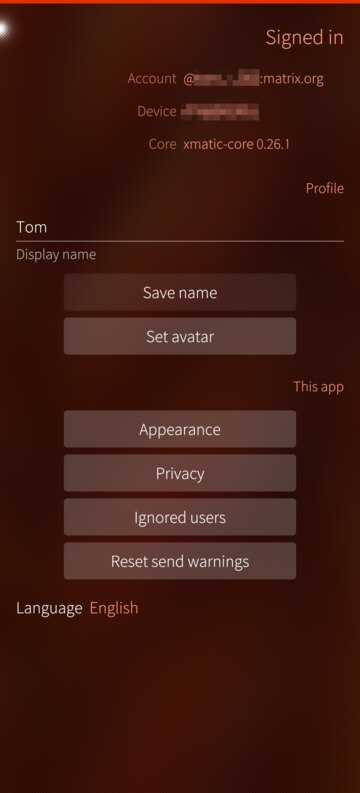
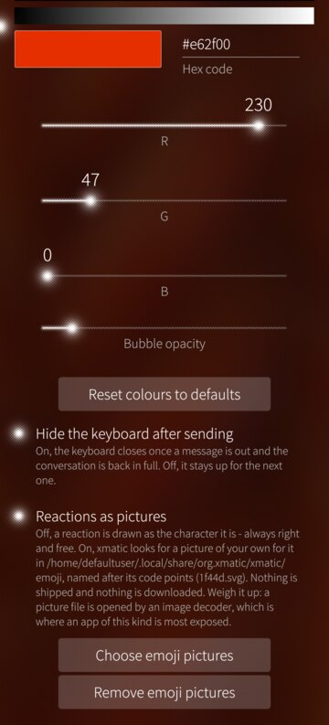

# xmatic

A native [Matrix](https://matrix.org) client for **Sailfish OS**, with a Silica
interface and a protocol core built on
[matrix-rust-sdk](https://github.com/matrix-org/matrix-rust-sdk).

Sailfish OS 5 still ships Qt 5.6, which rules out the existing Qt Matrix
libraries. xmatic links the same Rust core that modern clients use and keeps Qt
as the view layer, so sliding sync, end-to-end encryption, cross-signing,
device verification and key backup come from upstream rather than from this
repository.

## What works

* Sign-in by the homeserver's own page (OAuth 2.0 / MAS), by device code, or by
  password where the server offers no OAuth; the session survives restarts
* Session and local stores encrypted with a key from Sailfish Secrets; without
  that key service no store is created, and the app says what is missing
* Four coloured lines for backup, recovery, cross-signing and local storage
* Room list over Simplified Sliding Sync: search, unread counts, favourites,
  low priority, mute
* Timeline in encrypted rooms: send, reply, edit, delete, paginate, send again
* Message search inside a conversation, over an index kept on the device
* A line marks where reading stopped; the room opens there or at its newest
* A message's actions on a long press: copy, reply, forward, edit, pin, react,
  delete
* An error log under Account, with identifiers already removed
* Reactions with your own first tab; press and hold an emoji to keep it there
* Formatted messages rendered as formatting, rewritten inside the app
* Attachments: pictures with full-screen zoom, video, files; voice messages
* Device verification both ways, cross-signing, key backup and recovery
* Notifications for rooms not on screen; messages written offline go out later
* Rooms: create, invite, join by address, leave, direct chats, directory search
* Matrix links open the room they name — the tap itself never joins
* Spaces as their own navigation level, nested, with unread badges
* Members: list, profile with the encryption identity, moderation, ignore list
* Threads, pinned messages, own display name and avatar
* A padlock in front of a room's name says whether it is encrypted
* Unsent text stays in the room, in memory only
* Who read a message and who reacted, asked for on demand
* A share target for the system's share dialog, running or not
* Voice and video calls over WebRTC, end-to-end in an encrypted room
* Twenty-nine interface languages, picked in the app

## What it looks like

| | | |
|---|---|---|
|  |  |  |
| The room list, with search | Replies, reactions, a pinned message and a picture | What a room offers, including a call |
|  |  |  |
| A room's own settings and address | New chat, new room, join, discover | Public rooms, from your server or another |
|  |  |  |
| What is not in order yet, and what to do about it | Backup, recovery, cross-signing, local storage | The account, the device and this app |
|  |  |  |
| Every bubble, name and text colour is yours to set | Opacity, the keyboard, reactions as pictures | Twenty-nine languages, switchable in the app |
|  |  | |
| Who may call, and what others learn | What stays here, and for how long | |

Taken on a phone with a camera cutout, across several ambiences — the app takes
its colours from the one you use.

## What does not

* **Homeservers that sign in through their own web page (SSO).**
* **Clients that only speak MatrixRTC** — they dropped the 1:1 call flow.
* Search finds whole words in plain text only; the search page says so.
* Received video is converted on the CPU: functional, not smooth.
* The app has to stay open. There is no background daemon, the same way other
  messengers on this platform work.

  Push notifications are the way around that and are **off by default**. They
  need a UnifiedPush distributor and a push gateway you choose, and they
  disclose which rooms you get messages in, and when, to both. Read
  [docs/PUSH.md](docs/PUSH.md) first. Left off, nothing is created or told.
* Spoilers are marked rather than hidden.
* **Most translations are unreviewed.** German is the project language;
  Norwegian, Finnish, Swedish and Danish had a pass. An offer to review one is
  welcome — open an issue.
* Reactions are drawn as characters, which on this Qt means monochrome; your
  own pictures can be used instead.

## Requirements

* Sailfish OS 5.0 or newer on aarch64, or Sailfish OS 4.6 on armv7hl
  (community ports — see the note below), developer mode enabled
* Sailfish OS Platform SDK with the `SailfishOS-5.0.0.62-aarch64` target, plus
  `gstreamer1.0-devel`, `gstreamer1.0-plugins-base-devel` and
  `gstreamer1.0-plugins-bad-devel` installed into it
* Rust via rustup (version pinned in `rust-toolchain.toml`) and `cbindgen`
* A homeserver supporting Simplified Sliding Sync (MSC4186) — Synapse 1.114 or
  newer

## Building

```sh
cargo install cbindgen                     # once
scripts/build-core.sh                      # cross-build the Rust core
mb2 -t SailfishOS-5.0.0.62-aarch64 build   # build the RPM
```

32-bit, against Sailfish 4.6 with the matching SDK target:

```sh
SFOS_RELEASE=4.6.0.13 SFOS_ARCH=armv7hl scripts/build-core.sh
mb2 -t SailfishOS-4.6.0.13-armv7hl build
```

The package lands in `RPMS/`; install it with `pkcon install-local`. If the SDK
lives somewhere other than `$HOME/SailfishOS-Platform-SDK`, set
`SAILFISH_SDK_ROOT` (and optionally `SFOS_RELEASE` / `SFOS_ARCH`) first.

### Note for ported devices

Some hand-built port images leave the phone user out of the `privileged`
group. Sailfish's sandbox then cannot finish its setup and *any* sandboxed app
silently never starts. Official images are unaffected, and xmatic itself asks
for no privileged permissions. Check before installing:

```sh
id | grep -o privileged
```

If that prints nothing: `devel-su usermod -a -G privileged $USER`, then reboot.

The browser on Sailfish 4.6 cannot render current Matrix sign-in pages. Use
**"Sign in on another device"** instead: the app shows an address and a code,
and the sign-in happens in any other browser.

## How it fits together

```
qml/    Silica UI (Qt 5.6)
src/    C++ bridge: MatrixBridge (QObject), list models, image provider
core/   Rust staticlib "xmatic-core": tokio runtime, matrix-sdk,
        matrix-sdk-ui (SyncService / RoomList / Timeline), bundled SQLite, rustls
```

Commands go into the core as JSON; events come back as JSON through one
callback. That callback fires on a tokio thread, so the C++ side only hops into
the Qt loop with a queued `QMetaObject::invokeMethod`. The SDK's `VectorDiff`
streams map one-to-one onto `QAbstractListModel` insert/remove/change signals —
that mapping is the whole reason for this design. The FFI surface is six C
functions; everything else is a JSON message type.

## Licence

Copyright 2026 JimKnopfIoT. Apache-2.0, matching matrix-rust-sdk. The Rust core
links a number of upstream crates, each under its own permissive licence (see
`core/Cargo.toml` and the crates it pulls in).
